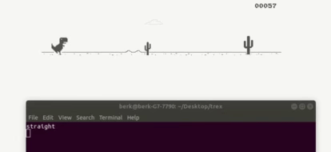

# Self-Driving-Google-Trex-Game-Cnn-Keras

 

# Summary
It's a simple CNN sample for bots.

There are 3 scripts. get_data.py takes a screenshot when you press a key and save it to the class's folder. There are 2 different classes(Up and Straight). Press Space for up, any key but space for straight. Train.py: trains the model. Play.py: loads and run the model.
Of course, there are many better methods for such a problem but this project only made for educational purposes.

# Pretrained Model
you can download **[HERE](https://drive.google.com/file/d/13INeRNWU0TYVM9kXvaPs8PDTdTiR3D0K/view?usp=sharing/)** It's trained with ~2500 images. 

# Dependencies
`pip install pynput`

`pip install mss`

and of course tensorflow, keras, PIL.

# How To Run

`python get_data.py` (press space for up, press any key but space for straight)

`python train.py`

`python play.py`

